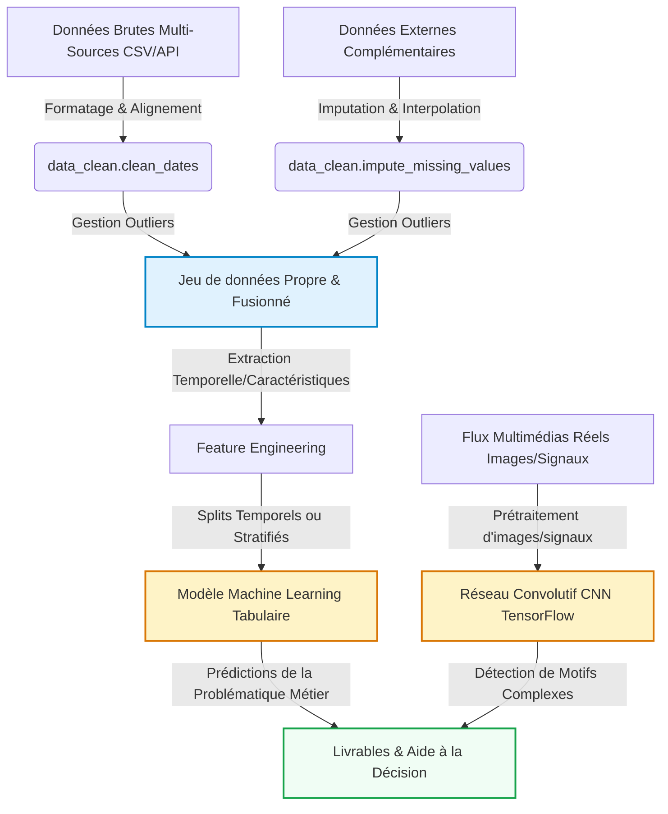

# Mon Projet Data Science

Étudiant(e) 1 : \[Blain Antoine\], Étudiant(e) 2 : \[Martin
Evan\], Étudiant(e) 3 : \[Pecontal Corentin\]
2026-05-20

[](https://github.com/aptitek/aptispace-datascience-projet/actions/workflows/ci.yml)
[GitHub Release](../../releases/latest)
[Quarto](https://quarto.org)
[Typst](https://typst.app)
[Python](https://python.org)

# Introduction et Contexte Métier

Présentez ici le contexte global de votre projet, la problématique
métier que vous cherchez à résoudre, les questions scientifiques
soulevées et les opportunités d’aide à la décision sur la base de vos
données. Dans le cadre de ce projet, nous travaillons sur une base de
données artificielle générée en 2024 reproduisant des trajets Uber et
les informations associées aux courses.

L’objectif principal de cette étude est de déterminer et prédire le prix
d’une course à partir de plusieurs variables, notamment le lieu de prise
en charge du client, la distance parcourue ainsi que d’autres
caractéristiques présentes dans les données.

Plusieurs questions se posent :

- Quels sont les paramètres ayant le plus d’impact sur le prix d’une
  course ?
- Existe-t-il une relation forte entre la distance et le tarif ?
- Le lieu de prise en charge influence-t-il significativement le prix
  final ?
- Peut-on construire un modèle prédictif fiable à partir des données
  disponibles ?

Afin de répondre à ces questions, différentes étapes seront réalisées :
préparation et nettoyage des données, analyse, visualisation des
tendances ETC.

## Contexte du Projet

- _Quels sont les objectifs globaux et le domaine d’étude de votre
  projet ?_
- _En quoi ce sujet de recherche est-il pertinent et stratégique ?_
- _Pourquoi l’analyse quantitative de ce jeu de données est-elle
  indispensable pour répondre à votre problématique ?_

Ce projet s’inscrit dans le domaine de la data science appliquée à la
mobilité du service UBER. Les plateformes de VTC exploitent de grandes
quantités de données afin d’optimiser leurs services, améliorer
l’expérience utilisateur et adapter leurs stratégies tarifaires.

Ce sujet est particulièrement pertinent car la prédiction des prix
représente un enjeu important pour les entreprises de transport. Une
meilleure compréhension des facteurs influençant les tarifs permet
d’optimiser les revenus et de proposer des prix cohérents aux diffèrent
utilisateurs.

L’analyse quantitative des données est essentielle pour répondre à cette
problématique. L’étude statistique et l’exploitation des données
permettent d’identifier les tendances, de mesurer l’impact des
différentes variables et de construire des modèles prédictifs fiables.
Les résultats obtenus peuvent ainsi servir d’aide pour améliorer les
stratégies de tarification.

## Objectif Analytique

- _Quelles sont les variables cibles principales et la tâche globale de
  modélisation (classification, régression, clustering, etc.) ?_
- _Comment le couplage de données multi-sources et l’intégration de
  différents types de données (tabulaires, images, signaux, etc.)
  enrichissent-ils l’analyse ?_
- _Quels sont les livrables analytiques attendus pour répondre à votre
  problématique et guider les prises de décisions ?_

La variable cible principale de ce projet est le _Booking Value_,
correspondant au prix du trajet. L’objectif est de prédire le coût d’une
réservation à partir de plusieurs variables comme la localisation de
départ (_Pickup Location_), la destination (_Drop Location_), la
distance du trajet (_Ride Distance_), le type de véhicule ou encore le
mode de paiement.

Les données tabulaires permettent d’analyser les relations entre les
différentes caractéristiques des trajets afin d’identifier les facteurs
ayant le plus d’impact sur le prix.

Les livrables attendus incluent des visualisations de données, des
indicateurs statistiques et un modèle prédictif capable d’estimer le
prix d’un trajet afin d’aider à l’optimisation des réservations et à la
prise de décision.

---

# Acquisition et Préparation des Données (Data Wrangling)

Le succès de tout projet de Data Science repose sur la qualité de la
préparation des données ([McKinney 2020](#ref-pandas2020)). Cette
section documente l’audit de qualité et les étapes de nettoyage
appliquées à vos jeux de données bruts.

## Chapitre 1 : Acquisition Multi-Sources

# 📥 Étape 1 : Acquisition des Données & Multi-Sources (Squelette Étudiant)

Cette étape correspond au premier chapitre du pipeline de Data Science.
L’objectif est d’identifier, d’importer et de consolider vos jeux de
données bruts issus de différentes sources (fichiers CSV locaux,
requêtes API, bases de données, etc.).

### 1. Initialisation de l’environnement

### 2. Chargement de la source de données principale

Chargement de notre jeu de données grace a un fichier CSV stocké dans
data/raw/

## → À voir si on ajoute d’autres données

### 3. Intégration de données secondaires (Multi-Sources)

**À COMPLÉTER PAR L’ÉTUDIANT :** Mettez en place la récupération de vos
données complémentaires (par exemple, appels d’API fictifs ou réels,
données météo, géographiques, ou financiers complémentaires).

### 4. Fusion des sources (Optionnel)

**À COMPLÉTER PAR L’ÉTUDIANT :** Associez vos différentes sources de
données en utilisant des jointures (`pd.merge`) pertinentes.

### 5. Consignation des données d’entrée brutes

Sauvegardez l’état brut de vos données d’entrée pour la suite du
pipeline.

## Chapitre 2 : Nettoyage et Préparation (Wrangling)

# 🧹 Étape 2 : Préparation & Nettoyage de Données (Data Wrangling) (Squelette Étudiant)

Cette étape correspond au deuxième chapitre du projet. L’objectif est
d’effectuer un audit de qualité de vos données brutes, puis de mettre en
œuvre un nettoyage rigoureux à l’aide de votre package personnalisé
`src.data_clean`.

### 1. Initialisation et imports

### 2. Chargement du dataset brut et Audit Initial

**À COMPLÉTER PAR L’ÉTUDIANT :** Chargez les données brutes et inspectez
la qualité du dataset (taux de valeurs manquantes, présence de doublons,
types erronés).

### 3. Uniformisation des Formats de Dates

**À COMPLÉTER PAR L’ÉTUDIANT :** Uniformisez la colonne temporelle pour
la convertir dans un type datetime standardisé via la fonction
pd.to_datetime.

### 4. Identification et Filtrage des Valeurs Aberrantes (Outliers)

**À COMPLÉTER PAR L’ÉTUDIANT :** Identifiez les anomalies physiques et
utilisez votre fonction `dc.handle_outliers` pour transformer ces
valeurs aberrantes en NaNs.

Vérifier correspondances entre Booking ID et colonnes Cancelled Rides

### 6. Sauvegarde des données propres

Enregistrez vos données de base nettoyées dans le répertoire
`data/processed/`.

---

# Visualisation Multidimensionnelle (Insights)

Nous présentons ici les résultats visuels clés permettant de dégager des
insights exploitables pour les décideurs, en s’appuyant sur notre module
`src/utils_viz.py`.

## Chapitre 3 : Travaux Pratiques d’Exploration Visuelle

# 📊 Étape 4 : Visualisation Multidimensionnelle (Squelette Étudiant)

Cette étape correspond au quatrième chapitre du cours. L’objectif est de
concevoir des représentations visuelles premium pour identifier des
tendances et insights clés à l’aide de votre package personnalisé de
tracé `src.utils_viz`.

### 1. Préparation de l’environnement

### 2. Chargement du dataset enrichi

### 3. Tracés et analyses graphiques

#### A. Évolution des tendances dans le temps

**À COMPLÉTER PAR L’ÉTUDIANT :** Tracez les tendances globales à l’aide
de la fonction `uv.plot_generic_trends`.

#### B. Carte de chaleur des corrélations

**À COMPLÉTER PAR L’ÉTUDIANT :** Visualisez graphiquement les
corrélations de Pearson à l’aide de `uv.plot_correlation_matrix`.

#### C. Nuage de points bivarié

**À COMPLÉTER PAR L’ÉTUDIANT :** Générez une analyse graphique bivariée
en utilisant `uv.plot_bivariate_scatter`.

---

# Analyse Exploratoire des Données (EDA)

Dans cette section, nous analysons les relations statistiques
fondamentales qui régissent votre domaine d’étude au sein du jeu de
données.

## Chapitre 4 : Travaux Pratiques d’Exploration (EDA)

# 🔎 Étape 3 : Analyse Exploratoire des Données (EDA) (Squelette Étudiant)

Cette étape correspond au troisième chapitre du cours. L’objectif est
d’explorer et de résumer les propriétés statistiques fondamentales de
vos données et de réaliser du **Feature Engineering** pour enrichir vos
modèles.

### 1. Préparation de l’environnement

### 2. Chargement des données nettoyées

### 3. Statistiques Descriptives

**À COMPLÉTER PAR L’ÉTUDIANT :** Générez les résumés statistiques
globaux et par groupes/catégories de votre jeu de données.

### 4. Ingénierie de variables (Feature Engineering)

**À COMPLÉTER PAR L’ÉTUDIANT :** Appliquez la fonction
`feature_engineering` de `src.data_clean` pour extraire des indicateurs
temporels de base, et ajoutez d’autres variables dérivées complexes
adaptées à votre problématique.

### 5. Analyse des Corrélations

**À COMPLÉTER PAR L’ÉTUDIANT :** Analysez la matrice des corrélations
des caractéristiques numériques à l’aide de Pandas.

---

# Modélisation et Apprentissage

Le pipeline complet intègre à la fois la branche analytique tabulaire
(Machine Learning) et la branche d’analyse visuelle ou de signaux
complexes (Deep Learning CNN) :



---

## 🛠️ Exécuter et compiler localement

Toutes les tâches du projet sont orchestrées simplement via le gestionnaire de tâches **Go-Task** (`task`).

### 1. Prérequis

Assurez-vous d'avoir installé :

- [Python 3.12](https://www.python.org/)
- [Quarto CLI](https://quarto.org/docs/get-started/)
- [Go-Task](https://taskfile.dev/installation/)

Installez ensuite les dépendances du projet :

```bash
pip install -r requirements.txt
```

### 2. Commandes de compilation rapides

Depuis la racine du projet, lancez :

- **Compiler l'intégralité du pipeline et des rapports** (génère tout dans `build/`) :
  ```bash
  task render
  ```
- **Prévisualiser dynamiquement le rapport dans le navigateur** (rechargement automatique lors de la saisie) :
  ```bash
  task preview
  ```
- **Compiler uniquement le guide d'installation** :
  ```bash
  task install-guide
  ```
- **Nettoyer tous les fichiers temporaires et compilations locales** :
  ```bash
  task clean
  ```

---

# _Développé dans le cadre du projet fil rouge de Data Science._

## Chapitre 6 : Travaux Pratiques d’Évaluation & Robustesse

# 🧪 Étape 6 : Évaluation Métrique & Robustesse (Squelette Étudiant)

Cette étape correspond au sixième chapitre du cours. L’objectif est de
mettre en place un protocole d’évaluation rigoureux (splits d’évaluation
adaptés) et de calculer les métriques clés de performance pour valider
scientifiquement la qualité de vos modèles.

### 1. Préparation de l’environnement

### 2. Évaluation du modèle Tabulaire

**À COMPLÉTER PAR L’ÉTUDIANT :** Calculez et interprétez les métriques
d’erreur sur vos prédictions (MAE, RMSE, R²).

### 3. Protocole de Validation Croisée (Out-of-Fold / Chronologique)

**À COMPLÉTER PAR L’ÉTUDIANT :** Décrivez et codez (ou documentez) une
stratégie de validation croisée adaptée au comportement temporel de vos
données pour valider la robustesse de votre modèle sans fuite
d’information.

---

# Data Storytelling et Communication

## Chapitre 7 : Travaux Pratiques de Storytelling

# 📢 Étape 7 : Data Storytelling & Communication (Squelette Étudiant)

Cette étape correspond au septième et dernier chapitre de data science.
L’objectif est de synthétiser vos résultats pour des profils métiers ou
décideurs et de proposer des visualisations interactives ou dynamiques
pour valoriser vos conclusions.

### 1. Préparation de l’environnement

### 2. Synthèse métier et Storytelling

**À COMPLÉTER PAR L’ÉTUDIANT :** Traduisez vos métriques techniques en
impacts stratégiques (par exemple, gains financiers, réduction de coûts,
amélioration de la sécurité, etc.).

<div id="plotly-22832f08-72ec-4fd6-8f94-e28319c1edfb"
style="width:100%; height:400px; background: white; border-radius: 8px;">
 
</div>
 
<script type="text/javascript">
  document.addEventListener("DOMContentLoaded", function() {
    if (typeof Plotly !== 'undefined') {
      Plotly.newPlot('plotly-22832f08-72ec-4fd6-8f94-e28319c1edfb', [{"type": "scatter", "x": [1, 2, 3], "y": [10, 15, 13], "mode": "lines+markers", "name": "Donn\u00e9es de Test"}], {"title": "Mon Graphique Plotly de Test"}, {"responsive": true});
    } else {
      console.error("Plotly library is not loaded.");
    }
  });
</script>
 
### 3. Visualisation Interactive (Plotly)
 
**À COMPLÉTER PAR L’ÉTUDIANT :** Générez un graphique interactif (par
exemple en utilisant Plotly ou des éléments OJS dans le document final)
pour permettre aux décideurs d’interagir dynamiquement avec vos données.
 
<div id="plotly-b710acc6-d2c3-49c1-8448-5c00fad65e93"
style="width:100%; height:400px; background: white; border-radius: 8px;">
 
</div>
 
<script type="text/javascript">
  document.addEventListener("DOMContentLoaded", function() {
    if (typeof Plotly !== 'undefined') {
      Plotly.newPlot('plotly-b710acc6-d2c3-49c1-8448-5c00fad65e93', [{"type": "scatter", "x": [1, 2, 3], "y": [10, 15, 13], "mode": "lines+markers", "name": "Donn\u00e9es de Test"}], {"title": "Mon Graphique Plotly de Test"}, {"responsive": true});
    } else {
      console.error("Plotly library is not loaded.");
    }
  });
</script>
 
## Présentation des Résultats (Livrables Interactifs)
 
<div class="panel-tabset">
 
### 📺 Diaporama de Soutenance (RevealJS)
 
Ci-dessous est intégré le squelette de votre diaporama de soutenance
RevealJS. Utilisez-le pour présenter votre démarche aux décideurs de
façon professionnelle.
 
<iframe src="slides.html" width="100%" height="500px" style="border: 1px solid #e2e8f0; border-radius: 8px; background: white;">
 
</iframe>
 
### 📊 Exemple de Dashboard Dynamique (OJS / Plotly)
 
Voici un exemple minimal de code montrant comment intégrer un graphique
dynamique contrôlé par un composant d’interface utilisateur en
Observable JS (OJS).
 
<div style="background: #f8fafc; padding: 1.5rem; border-radius: 8px; border: 1px solid #e2e8f0; margin-bottom: 1.5rem;">
  <div style="margin-bottom: 1rem; font-family: sans-serif;">
    <label for="selectedCategory-select" style="font-weight: 600; margin-right: 0.5rem; color: #1e293b;">Filtrer par Catégorie :</label>
    <select id="selectedCategory-select" style="padding: 0.5rem; border-radius: 4px; border: 1px solid #cbd5e1; background: white; color: #1e293b;">
      <option value="Toutes" selected>Toutes</option>
      <option value="A">A</option>
      <option value="B">B</option>
      <option value="C">C</option>
    </select>
  </div>
  
</div>
 
<script type="text/javascript">
  document.addEventListener("DOMContentLoaded", function() {
    const data = [
  {timestamp: "2026-05-18T00:00:00Z", value: 10.5, category: "A"},
  {timestamp: "2026-05-18T02:00:00Z", value: 12.1, category: "A"},
  {timestamp: "2026-05-18T04:00:00Z", value: 14.7, category: "A"},
  {timestamp: "2026-05-18T05:00:00Z", value: 15.2, category: "A"},
  {timestamp: "2026-05-18T06:00:00Z", value: 16.0, category: "B"},
  {timestamp: "2026-05-18T07:00:00Z", value: 18.3, category: "B"},
  {timestamp: "2026-05-18T09:00:00Z", value: 21.5, category: "B"},
  {timestamp: "2026-05-18T10:00:00Z", value: 22.0, category: "B"},
  {timestamp: "2026-05-18T12:00:00Z", value: 25.4, category: "C"},
  {timestamp: "2026-05-18T13:00:00Z", value: 26.1, category: "C"},
  {timestamp: "2026-05-18T15:00:00Z", value: 28.9, category: "C"},
  {timestamp: "2026-05-18T16:00:00Z", value: 30.2, category: "C"}
];
 
    function updatePlot(category) {
      if (typeof Plotly === 'undefined') {
        console.error("Plotly is not loaded");
        return;
      }
      // Boutons de sélection interactifs OJS
      // Données simulées réactives
      // Filtrage réactif de la donnée
      const filteredData = category === "Toutes"
        ? data
        : data.filter(d => d.category === category)
      // Tracé interactif avec la librairie Plotly
      Plotly.newPlot('dynamic-chart', [{
        x: filteredData.map(d => d.timestamp),
        y: filteredData.map(d => d.value),
        type: 'scatter',
        mode: 'lines+markers',
        marker: {color: '#1A73E8', size: 8},
        line: {shape: 'spline', color: '#1A73E8', width: 3}
      }], {
        title: 'Évolution Dynamique des Valeurs (Filtrée)',
        margin: {t: 50, b: 50, l: 50, r: 50},
        paper_bgcolor: 'rgba(0,0,0,0)',
        plot_bgcolor: 'rgba(0,0,0,0)',
        xaxis: {gridcolor: '#E5E7EB'},
        yaxis: {gridcolor: '#E5E7EB'}
      })
    }
 
    const select = document.getElementById("selectedCategory-select");
    if (select) {
      select.addEventListener("change", function(e) {
        updatePlot(e.target.value);
      });
      updatePlot(select.value);
    }
  });
</script>
 
 
 
 
 
 
</div>
 
------------------------------------------------------------------------
 
# Utilisation de l’Intelligence Artificielle
 
Dans une démarche de transparence scientifique et académique, cette
section détaille la manière dont les outils d’Intelligence Artificielle
(IA) générative ont été intégrés tout au long de la réalisation de ce
projet.
 
## Cartographie de l’utilisation de l’IA
 
| Outil d’IA | Cas d’usage (Pourquoi ?) | Méthode d’utilisation (Comment ?) | Rôle et Validation Humaine |
|:---|:---|:---|:---|
| **\[Outil d’IA\]** | *\[À compléter par les étudiants\]* | *\[À compléter par les étudiants\]* | *\[À compléter par les étudiants\]* |
 
## Principes de Rigueur et Responsabilité
 
1.  **Responsabilité intellectuelle** : L’équipe assume l’entière
    responsabilité des analyses, des choix de modèles et des conclusions
    présentées dans ce rapport.
2.  **Lutte contre les hallucinations** : Chaque suggestion technique a
    fait l’objet d’une validation empirique.
3.  **Protection des données** : Aucun jeu de données confidentiel ou
    sensible n’a été soumis à des modèles tiers en ligne.
 
------------------------------------------------------------------------
 
# Bibliographie
 
<div id="refs" class="references csl-bib-body hanging-indent">
 
<div id="ref-pandas2020" class="csl-entry">
 
McKinney, Wes. 2020. *Python for Data Analysis: Data Wrangling with
Pandas, NumPy, and IPython*. O’Reilly Media.
 
</div>
 
</div>
 
<script type="ojs-module-contents">
eyJjb250ZW50cyI6W119
</script>
 
<div id="exercise-loading-indicator"
class="exercise-loading-indicator d-none d-flex align-items-center gap-2">
 
<div id="exercise-loading-status" class="d-flex gap-2">
 
</div>
 
<div class="spinner-grow spinner-grow-sm">
 
</div>
 
</div>
 
<script type="vfs-file">
W10=
</script>
