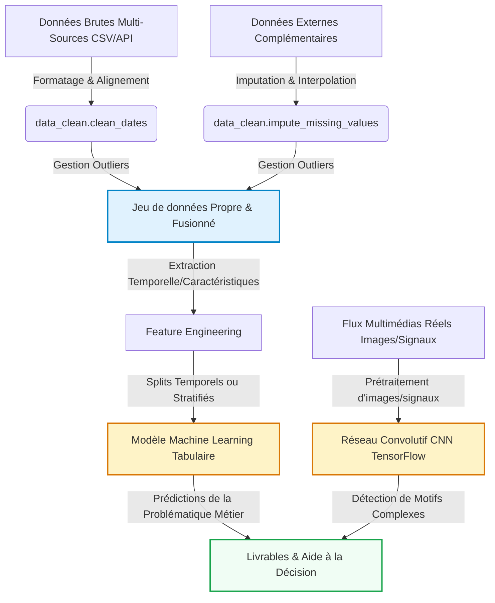

```{python}
#| echo: false
#| output: false
# Configuration globale de Pandas pour éviter que les tableaux 
# ne débordent de la page PDF (Typst)
import pandas as pd
pd.set_option('display.max_columns', 5)
pd.set_option('display.max_colwidth', 12)
```

# Introduction et Contexte Métier {#sec-intro}

## Contexte du Projet

Aujourd'hui, la musique se consomme principalement en streaming, et 
Spotify s'est imposé comme le leader mondial avec plus de 600 millions 
d'utilisateurs actifs. Récemment, une nouvelle dynamique a bouleversé l'industrie : les **trends de danse sur les réseaux sociaux** (comme TikTok). C'est devenu une véritable stratégie marketing de lancer une trend avant même la sortie officielle d'un titre pour booster sa popularité.

Cependant, pour qu'une trend fonctionne, il faut que les caractéristiques intrinsèques de la chanson s'y prêtent (sa *danceability*, son tempo, son énergie). C'est précisément l'objectif de notre étude : **évaluer à quel point les caractéristiques musicales pures (et notamment la dansabilité) impactent la popularité d'une chanson, indépendamment du budget marketing ou de la notoriété préalable de l'artiste.**


## Objectif Analytique


Notre objectif principal est de prédire la popularité d'une chanson à 
partir de ses caractéristiques musicales mesurables. La variable cible 
est le score de `popularity` (de 0 à 100), ce qui en fait une tâche de 
**régression**, complétée par une **classification binaire** via la 
variable `is_popular` que nous avons créée.

Pour enrichir notre analyse, nous avons également intégré des données 
secondaires sur les genres musicaux, combinant ainsi deux sources 
complémentaires. Nos analyses ont révélé un résultat surprenant : les 
caractéristiques musicales n'expliquent qu'une partie de la popularité. 
D'autres facteurs — la notoriété de l'artiste, le marketing ou 
l'algorithme Spotify lui-même — semblent jouer un rôle tout aussi 
décisif. Notre modèle de Machine Learning viendra confirmer ou infirmer 
cette hypothèse.

---

# Acquisition et Préparation des Données (Data Wrangling) {#sec-wrangling}


## Chapitre 1 : Acquisition Multi-Sources


## Chapitre 2 : Nettoyage et Préparation (Wrangling)


---

# Visualisation Multidimensionnelle (Insights) {#sec-viz}

Nous présentons ici les résultats visuels clés permettant de dégager des insights exploitables pour les décideurs, en s'appuyant sur notre module `src/utils_viz.py`.

## Chapitre 3 : Travaux Pratiques d'Exploration Visuelle


---

# Analyse Exploratoire des Données (EDA) {#sec-eda}

Dans cette section, nous analysons les relations statistiques fondamentales qui régissent votre domaine d'étude au sein du jeu de données.

## Chapitre 4 : Travaux Pratiques d'Exploration (EDA)


---

# Modélisation et Apprentissage {#sec-modelling}

Le pipeline complet intègre à la fois la branche analytique tabulaire (Machine Learning) et la branche d'analyse visuelle ou de signaux complexes (Deep Learning CNN) :



## Chapitre 5 : Travaux Pratiques de Modélisation (ML & DL)


---

# Évaluation Métrique et Validation {#sec-evaluation}

## Chapitre 6 : Travaux Pratiques d'Évaluation & Robustesse


---

# Data Storytelling et Communication {#sec-storytelling}

## Chapitre 7 : Travaux Pratiques de Storytelling


## Présentation des Résultats (Livrables Interactifs)

::: {.content-visible unless-format="typst"}

::: {.panel-tabset}

### 📺 Diaporama de Soutenance (RevealJS)
Ci-dessous est intégré le squelette de votre diaporama de soutenance RevealJS. Utilisez-le pour présenter votre démarche aux décideurs de façon professionnelle.

<iframe src="slides.html" width="100%" height="500px" style="border: 1px solid #e2e8f0; border-radius: 8px; background: white;"></iframe>

### 📊 Exemple de Dashboard Dynamique (OJS / Plotly)

Voici un exemple minimal de code montrant comment intégrer un graphique dynamique contrôlé par un composant d'interface utilisateur en Observable JS (OJS).

```{ojs}
//| echo: true
// Boutons de sélection interactifs OJS
viewof selectedCategory = Inputs.select(["Toutes", "A", "B", "C"], {value: "Toutes", label: "Filtrer par Catégorie :"})
```

```{ojs}
//| echo: false
// Données simulées réactives
data = [
  {timestamp: "2026-05-18T00:00:00Z", value: 10.5, category: "A"},
  {timestamp: "2026-05-18T02:00:00Z", value: 12.1, category: "A"},
  {timestamp: "2026-05-18T04:00:00Z", value: 14.7, category: "A"},
  {timestamp: "2026-05-18T05:00:00Z", value: 15.2, category: "A"},
  {timestamp: "2026-05-18T06:00:00Z", value: 16.0, category: "B"},
  {timestamp: "2026-05-18T07:00:00Z", value: 18.3, category: "B"},
  {timestamp: "2026-05-18T09:00:00Z", value: 21.5, category: "B"},
  {timestamp: "2026-05-18T10:00:00Z", value: 22.0, category: "B"},
  {timestamp: "2026-05-18T12:00:00Z", value: 25.4, category: "C"},
  {timestamp: "2026-05-18T13:00:00Z", value: 26.1, category: "C"},
  {timestamp: "2026-05-18T15:00:00Z", value: 28.9, category: "C"},
  {timestamp: "2026-05-18T16:00:00Z", value: 30.2, category: "C"}
]

filteredData = selectedCategory === "Toutes"
  ? data
  : data.filter(d => d.category === selectedCategory)

Plotly.newPlot('dynamic-chart', [{
  x: filteredData.map(d => d.timestamp),
  y: filteredData.map(d => d.value),
  type: 'scatter',
  mode: 'lines+markers',
  marker: {color: '#1A73E8', size: 8},
  line: {shape: 'spline', color: '#1A73E8', width: 3}
}], {
  title: 'Évolution Dynamique des Valeurs (Filtrée)',
  margin: {t: 50, b: 50, l: 50, r: 50},
  paper_bgcolor: 'rgba(0,0,0,0)',
  plot_bgcolor: 'rgba(0,0,0,0)',
  xaxis: {gridcolor: '#E5E7EB'},
  yaxis: {gridcolor: '#E5E7EB'}
})
```

::: {#dynamic-chart style="width:100%; height:400px; background: white; border-radius: 8px; box-shadow: 0 4px 6px -1px rgba(0,0,0,0.1);"}
:::

:::

:::

::: {.content-visible when-format="typst"}
*Les livrables interactifs (diaporama RevealJS, dashboard dynamique) sont disponibles dans la version HTML du rapport.*
:::

---

# Utilisation de l'Intelligence Artificielle {#sec-ai}

Dans une démarche de transparence scientifique et académique, cette section détaille la manière dont les outils d'Intelligence Artificielle (IA) générative ont été intégrés tout au long de la réalisation de ce projet.

## Cartographie de l'utilisation de l'IA

| Outil d'IA | Cas d'usage (Pourquoi ?) | Méthode d'utilisation (Comment ?) | Rôle et Validation Humaine |
| :--- | :--- | :--- | :--- |
| **Gemini / ChatGPT** | Compréhension du code, débogage Quarto/Typst, et structuration du storytelling | Prompts itératifs pour débloquer des erreurs spécifiques (ex: tableaux superposés) et aide à la synthèse | Vérification manuelle de chaque bloc de code suggéré et réécriture des textes pour correspondre au contexte. |
| **GitHub Copilot (ou équivalent)** | Accélération de l'écriture du code Pandas / Plotly dans les notebooks | Autocomplétion lors de l'Analyse Exploratoire (EDA) et de la création de graphiques | Relecture du code généré pour s'assurer de la justesse des calculs statistiques. |

: Cartographie de l'utilisation des outils IA {tbl-colwidths="[15,30,30,25]"}

## Principes de Rigueur et Responsabilité

1. **Responsabilité intellectuelle** : L'équipe assume l'entière responsabilité des analyses, des choix de modèles et des conclusions présentées dans ce rapport.
2. **Lutte contre les hallucinations** : Chaque suggestion technique a fait l'objet d'une validation empirique.
3. **Protection des données** : Aucun jeu de données confidentiel ou sensible n'a été soumis à des modèles tiers en ligne.

---

# Conclusion Générale {#sec-conclusion}

L'objectif initial de ce projet était de vérifier si des caractéristiques musicales, en particulier la **dansabilité (danceability)**, étaient suffisantes pour garantir le succès d'un titre, notamment à l'ère des trends sur les réseaux sociaux. 

Nos phases d'Analyse Exploratoire (EDA) et de Modélisation ont révélé des résultats particulièrement intéressants :
- **Une corrélation faible mais existante** : Contrairement aux idées reçues, la corrélation linéaire directe entre la `danceability` et la `popularity` n'est pas absolue (environ 0.06 dans nos données globales). Une musique "dansante" n'est donc pas automatiquement populaire.
- **Le poids du contexte** : Nos modèles de Machine Learning démontrent que les caractéristiques audio seules ne suffisent pas à prédire parfaitement le succès (R² de 0.446). Les erreurs de prédiction parfois importantes (différence significative entre MAE et RMSE) prouvent que le succès est très volatil pour un même profil musical.

**Bilan métier** : Bien qu'avoir une musique avec une forte `danceability` soit un **prérequis** essentiel pour lancer une trend marketing (sur TikTok ou Reels), ce n'est pas le moteur principal de la popularité globale. Le succès final reste massivement dicté par des facteurs externes non-musicaux : la stratégie marketing du label, la base de fans existante de l'artiste et les algorithmes de recommandation des plateformes.

---

# Bibliographie {.unnumbered}

::: {#refs}
:::